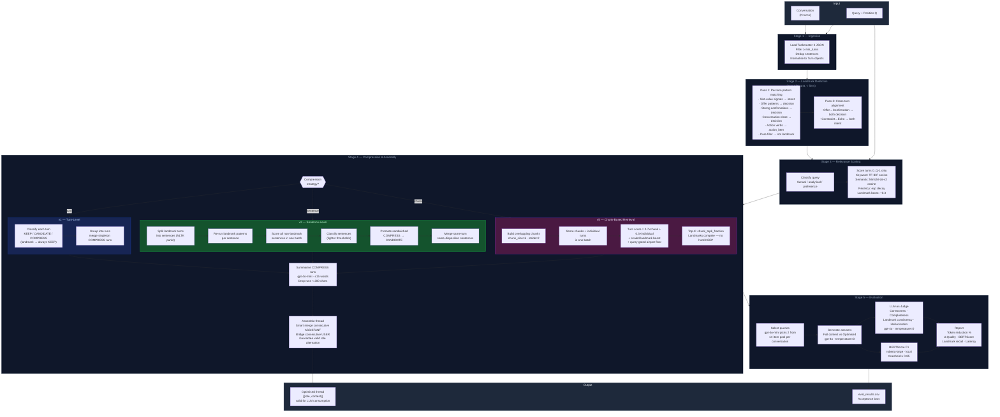

# Architecture Decisions Document
## Intelligent Context Optimizer for Multi-Turn Agents

**Version:** 1.5
**Date:** April 2026
**Status:** Implemented

---

## 1. System Overview

The Context Optimizer takes a multi-turn conversation and a current query, and returns a compressed conversation thread that preserves the information the LLM needs to answer the query — and discards what it doesn't.

```
Input:  Conversation (N turns) + Query string (at position Q in the conversation)
Output: Optimised [{role, content}] thread covering turns 0..Q-1 (24–44% fewer tokens)
```

**Critical constraint:** Only turns *before* the current query position are considered. Turn Q itself is the query being answered — it is not part of the context window. This mirrors real agent behaviour.

Five compression strategies are implemented, selectable via `--compression-strategy`:
- `turn` — v1: threshold-based turn-level (default, conservative)
- `sentence` — v2: sentence-level within landmark turns
- `topk` — v3: proportional top-K turn retrieval
- `topk-sentence` — v4: top-K across all units including landmark sentences
- `chunk` — v5: overlapping multi-turn chunk scoring + top-K

Each stage has a clean interface. Components are swappable without touching adjacent stages.

---

## 2. Pipeline Diagram



---

## 3. Project Structure

```
context_optimizer/
├── src/
│   ├── ingestion/
│   │   ├── loader.py                      # Load, filter, normalise, dedup
│   │   └── models.py                      # Conversation, Turn, OptimizerConfig dataclasses
│   ├── scoring/
│   │   ├── scorer.py                      # Composite relevance scorer
│   │   ├── keyword.py                     # TF-IDF keyword match
│   │   ├── semantic.py                    # Embedding cosine similarity (MiniLM-L6-v2)
│   │   ├── recency.py                     # Exponential decay
│   │   └── query_classifier.py            # Factual / analytical / preference
│   ├── landmarks/
│   │   ├── detector.py                    # Pluggable detector interface + factory
│   │   └── rule_detector.py               # v1: rule-based + two-pass alignment
│   ├── compression/
│   │   ├── compressor.py                  # v1 turn-level: classify + group into runs
│   │   ├── sentence_compressor.py         # v2 sentence-level: split, score, classify, merge
│   │   ├── sentence_splitter.py           # NLTK punkt sentence boundary detection
│   │   ├── topk_compressor.py             # v3 proportional top-K turn retrieval
│   │   ├── topk_sentence_compressor.py    # v4 top-K across all units incl. landmark sentences
│   │   ├── chunk_compressor.py            # v5 overlapping chunk scoring + top-K
│   │   ├── summariser.py                  # LLM summarisation (one call per run)
│   │   ├── assembler.py                   # Assemble thread, smart merge, integrity check
│   │   └── pipeline.py                    # compress() entry point — selects strategy
│   └── evaluation/
│       ├── harness.py                     # Full evaluation loop, query selection, acceptance bars
│       ├── judge.py                       # LLM-as-judge, 4-dimension rubric
│       ├── bertscore_metric.py            # BERTScore F1 (local)
│       └── landmark_recall.py             # Recall vs. slot annotation GT
├── utilities/                             # Inspection and audit scripts
├── tests/                                 # pytest suite (73 tests, no LLM calls)
├── main.py                                # CLI: stats, inspect, evaluate
└── .env                                   # API keys (gitignored)
```

---

## 4. Core Data Model

```python
@dataclass
class Turn:
    turn_index: int
    speaker: str                      # "USER" or "ASSISTANT"
    text: str
    slots: list[str]                  # Slot names from Taskmaster-2 annotations
                                      # EVALUATION GROUND TRUTH ONLY
    is_landmark: bool = False
    landmark_type: str | None = None  # "intent" | "decision" | "action_item"
    landmark_reason: str = ""         # Human-readable reason (auditable)
    promoted: bool = False            # True if promoted by cross-turn alignment
    score: float = 0.0                # Set by relevance scorer
    disposition: str = ""             # "KEEP" | "CANDIDATE" | "COMPRESS"
```

---

## 5. Stage 1 — Ingestion & Normalisation

**Module:** `src/ingestion/loader.py`

Load Taskmaster-2 JSON, filter by turn count, apply data-quality fixes, normalise to `Conversation` objects.

**Data quality fixes applied at load time:**
- `_dedup_sentences()` — removes consecutively repeated sentences within a single utterance. Taskmaster-2 crowdworkers occasionally re-stated a sentence before completing the thought. This is structural noise, not signal.

---

## 6. Stage 2 — Landmark Detection

**Module:** `src/landmarks/`

### 6.1 Detector Interface (pluggable)

```python
class LandmarkDetector(Protocol):
    def detect(self, conversation: Conversation) -> Conversation: ...
```

### 6.2 v1 — Rule-Based + Two-Pass Alignment

**Pass 1 — individual turn scoring:**

| Signal | Landmark type |
|---|---|
| USER: explicit intent verb ("I'd like", "I need") | `intent` |
| USER: slot-value signal (price, date, airline, seat class, stops) | `intent` |
| USER: strong confirmation ("I'll take the 6AM flight") | `decision` |
| USER: conversation-close signal ("that's all", "goodbye", "I'm done") | `decision` |
| ASSISTANT: offer pattern (specific price/time/flight details) | `decision` |
| ASSISTANT: slot-value signal | `decision` |
| ASSISTANT: action commitment ("I'll send", "tickets confirmed") | `action_item` |
| Short pure filler ("okay", "sure", "hold on") | Not a landmark |

**Pass 2 — cross-turn alignment:**
- Pattern A (Offer→Confirmation): ASSISTANT[i] offer + USER[i+1] weak confirmation → both `decision`
- Pattern B (Constraint→Echo): USER[i] slot signal + ASSISTANT[i+1] echo → both `intent`

**Measured: 86.8% GT recall, 46.4% landmark rate, 53.6% compressible.**

---

## 7. Stage 3 — Relevance Scoring

**Module:** `src/scoring/scorer.py`

```
S(t, q) = w1·keyword(t,q) + w2·semantic(t,q) + w3·recency(t,Q) + landmark_boost(t)
```

**Weights by query type:**

| Query Type | keyword | semantic | recency |
|---|---|---|---|
| Factual | 0.3 | 0.5 | 0.2 |
| Analytical | 0.2 | 0.4 | 0.4 |
| Preference | 0.2 | 0.3 | 0.5 |

---

## 8. Stage 4 — Compression & Assembly

### 8.1 v1 — Turn-Level (`compressor.py`)

Landmarks hard-KEEPed. Non-landmark turns classified by score threshold. Thresholds: factual (0.72/0.45), analytical (0.65/0.40), preference (0.60/0.35). Contiguous COMPRESS turns grouped into runs; one LLM call per run.

**Eval: 24.1% token reduction, Δquality +0.01, BERTScore 0.940, 628ms.**

### 8.2 v2 — Sentence-Level (`sentence_compressor.py`)

Landmark turns split into sentences. Only landmark sentences hard-KEEPed. Non-landmark sentences scored in one batch against query. Tighter `sentence_thresholds`. Sandwiched COMPRESS sentences promoted; same-turn sentences merged before assembly.

**Spot-check: 34.1% token reduction, 40% turn reduction on synthetic conversation.**

### 8.3 v3 — Top-K Retrieval (`topk_compressor.py`)

No hard-KEEP for landmarks — they receive +0.3 boost but compete in top-K pool. Non-landmark turns below `topk_min_score=0.30` always compressed. Top K% kept via `topk_fraction` (factual=20%, analytical=35%, preference=25%).

**Eval: 21% token reduction, Δquality -0.06. Quality risk: relevant turns can fall outside top-K.**

### 8.4 v4 — Top-K Sentence (`topk_sentence_compressor.py`)

Combines v2 sentence splitting with v3 top-K. All units (landmark sentences + non-landmark turns) scored and ranked together. Landmark boost scaled by individual score (`boost × indiv_score`) to prevent query-irrelevant landmarks from dominating. Uses `topk_sentence_fraction` (higher than v3 because unit count increases after splitting).

**Limitation: short sentences have insufficient embedding signal — 6-word sentences systematically undervalued.**

### 8.5 v5 — Chunk-Based Retrieval (`chunk_compressor.py`)

**Key insight:** the answer to a query is often spread across multiple consecutive turns. Scoring turns individually misses this.

**Scoring:** overlapping chunks of `chunk_size=6` turns with `stride=2`. All chunks + individual turns scored in one batch. Each turn's final score = `0.7 × max_chunk_score + 0.3 × individual_score`. The chunk component captures answer-spanning relevance; the individual component prevents irrelevant turns from riding a high chunk score. Landmark boost scaled by individual score.

**Airport floor:** when the query contains airport-related vocabulary ("airport", "terminal", "fly from/to"), turns mentioning IATA codes or airport names receive `score ≥ 0.45`, preventing airport queries from silently dropping the relevant turns.

**Classification:** top K% via `chunk_topk_fraction` (factual=35%, analytical=55%, preference=45%). No hard-KEEP for landmarks.

**Eval: 43.4% token reduction — first strategy to hit 40–60% target on real corpus. BERTScore 0.935–0.947, 100% ≥ 0.85. Two airport queries are persistent failures (Δ ≈ -3 to -5); LLM judge variance makes Δ quality unstable across runs.**

### 8.6 Summarisation (`summariser.py`)

One gpt-4o-mini call per COMPRESS run. Runs shorter than 200 characters dropped silently. Summary capped at ≤15 words.

### 8.7 Assembly (`assembler.py`)

- KEEP/CANDIDATE runs → verbatim turns in chronological order
- COMPRESS runs → single `[SUMMARY: ...]` assistant turn
- Smart merge: consecutive ASSISTANT turns merged, substring/near-duplicate detection
- Integrity check: consecutive USER turns bridged with `[context continues]`

---

## 9. Stage 5 — Evaluation

### 9.1 Query Selection

Per-conversation: gpt-4o-mini reads first 15 turns and selects the 2 most answerable queries from a 14-item pool.

### 9.2 Metrics

| Metric | Method | Target |
|---|---|---|
| Token reduction % | `(full - opt) / full` | 40–60% |
| Quality Δ (LLM judge) | Mean of 4 dimensions, opt minus full | ≥ 0 |
| BERTScore F1 | roberta-large, local | ≥ 0.85 |
| Landmark recall | `|detected ∩ GT| / |GT|` | Reported |
| Latency | Wall-clock ms for compress() | Reported |

### 9.3 LLM-as-Judge

Each answer evaluated independently against its own context. Temperature=0. 4 dimensions: correctness, completeness, landmark consistency, hallucination.

**Note on judge variance:** gpt-4o produces non-deterministic scores even at temperature=0 due to floating-point non-determinism in the backend. Full-context quality scores varied by up to 0.3 points between identical runs. BERTScore (deterministic) is the stable quality signal for cross-run comparison.

---

## 10. CLI

```
python main.py stats
python main.py --compression-strategy chunk inspect --conv-id X --query Y --query-pos N
python main.py --compression-strategy chunk inspect --conv-id X --query Y --query-pos N --dry-run
python main.py --compression-strategy chunk inspect --conv-id X --query Y --query-pos N --compare
python main.py --compression-strategy chunk evaluate
# strategies: turn | sentence | topk | topk-sentence | chunk
```

---

## 11. Rejected Alternatives

- **RAG-style retrieval** — ignores turn order, cannot enforce landmark preservation for turns dissimilar to query
- **Sliding window truncation** — drops critical early context (original intent)
- **Summarise everything** — loses precision on exact values (prices, dates, flight numbers)
- **LLM as default landmark detector** — net cost problem; 86.8% rule-based recall sufficient for v1
- **Merging consecutive USER turns** — misrepresents conversational structure; bridge approach chosen instead
- **Hard-KEEP for landmarks in top-K strategies** — query-agnostic; wastes budget on irrelevant facts. v3–v5 use landmark boost instead

---

## 12. What Breaks at Scale (500+ Turns)

| Failure Mode | Root Cause | Mitigation |
|---|---|---|
| Embedding latency | Linear with turns | Batch encode once; cached |
| Summarisation cost | One call per COMPRESS run | Short-run drop threshold; singleton merging |
| Landmark detection drift | Regex degrades on unusual phrasing | Upgrade to embedding detector (v2) |
| Assembly integrity failures | More anomalies in long conversations | Smart merge + integrity check with logging |
| Context window exceeded | Summarised thread still too long | Hard token cap; second summarisation pass |
| v2/v5 scoring latency | Large batch on CPU | GPU deployment |
| Chunk scoring with very short turns | Chunk text too sparse for embedding | Increase chunk_size or fall back to v1 |

---

## 13. Net Cost Analysis

```
Cost    = summarisation_runs × avg_tokens × cost/token
Savings = (full_tokens - opt_tokens) × cost/token × downstream_calls

Net     = Savings - Cost
```

Break-even with rule-based detection: **≥2 downstream calls per optimised context.**

---

## 14. Dependencies

| Package | Purpose | Where |
|---|---|---|
| `sentence-transformers` | Semantic embeddings (MiniLM-L6-v2) | Local (CPU) |
| `scikit-learn` | TF-IDF | Local |
| `bert-score` | BERTScore F1 | Local |
| `tiktoken` | Token counting | Local |
| `nltk` | Sentence boundary detection (punkt) | Local |
| `openai` | Summarisation + judge + query selection | API |
| `python-dotenv` | `.env` loading with override | Local |
| `pandas` | Evaluation results | Local |
| `pytest` | Test runner | Local |
